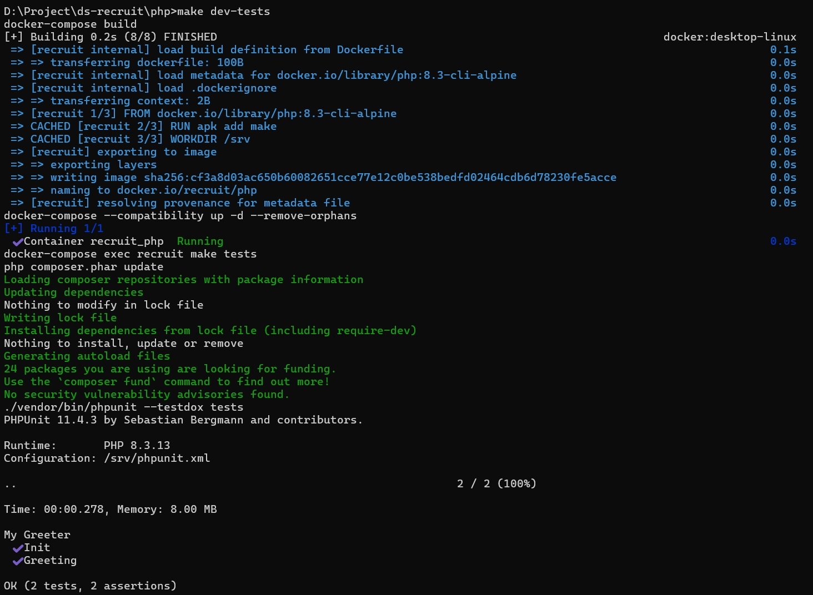
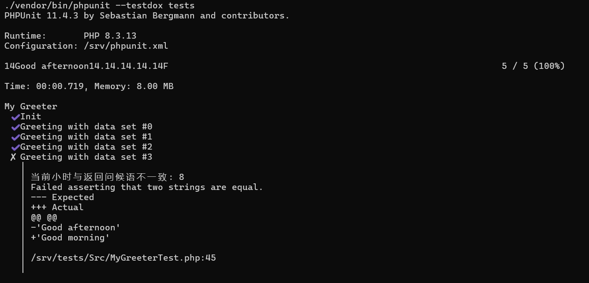

动手
----

1. 希望你实现一个类（MyGreeter），满足以下条件：
  - 能够实例化。
    - 当运行时间在6AM至12AM之间时，返回 "Good morning"。
    - 当运行时间在12AM至6PM之间时，返回 "Good afternoon"。
    - 当运行时间在6PM至第二天6AM之间时，返回 "Good evening"。
  - _答：文件目录 php/Src/MyGreeter.php_

2. 希望你实现的这个类能通过我们预先准备的单元测试类（MyGreeterTest）
  - `make dev-tests` 这个命令可以在你的环境里运行？
    - （1）_执行前必要环境_：Window系统，Docker和make
    - （2）make dev-tests命令里有执行make tests，但此时运行的环境在容器里，原容器Dockerfile制作的镜像并没有make命令，因此修改了Dockerfile文件，增加RUN apk add make; 其次为了保证容器的时间一致也需要设置一下时区，详见Dockerfile文件
  -
  - 运行结果显示，所有的测试项目都正常通过？(通过)
    - _原代码测试结果：_
    - 
    - 
    - _修改后的测试结果：_
    - 
   

思考
----

当你完成上述动手项目后，请进一步思考并回答以下2个问题。

1. 我们准备的单元测试类（MyGreeterTest）是否存在问题？_（是）_
2. 如果问题1你的答案"是"的话，请问有哪些问题？以及你认为针对每个问题应该如何改善？
  - 答：当前测试只验证返回值长度，无法确保内容是否符合预期。增加对返回值的精确检查，例如验证输出是否为 "Good morning"、"Good afternoon" 或 "Good evening"，已达到代码的正确性；具体看tests/Src/MyGreeterTest.php文件

eg:
----
- 我的GitHub和gitee
- https://github.com/longdaihai
- https://gitee.com/haiyunyi_cn